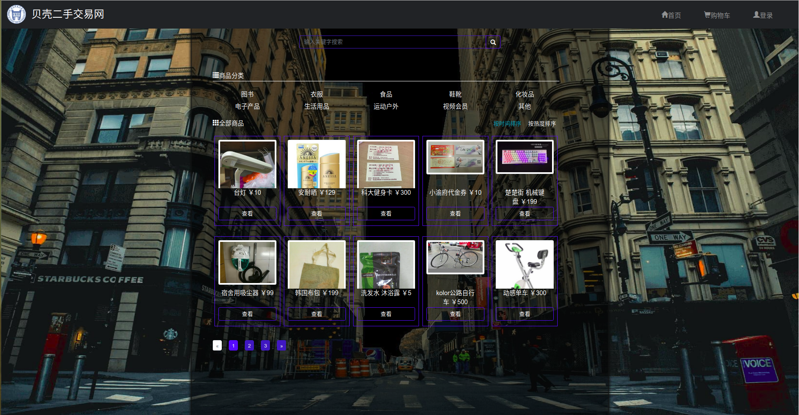
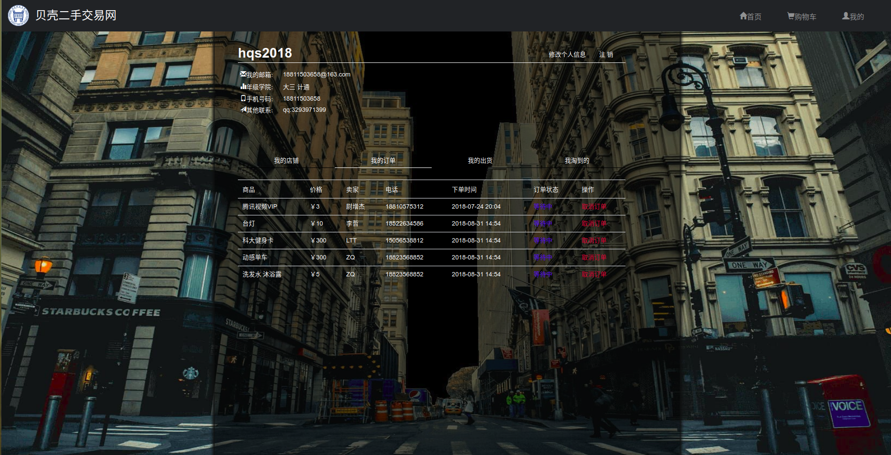

# Micromarket
### 项目简介
校园二手交易网站，意在创建一个平台，帮助学生转手自己不用的生活用品或二手书籍，网站的目标是提供一个渠道，将有意向的买家和卖家联系在一起。每个注册的用户都可以成为买家或卖家，挂上自己的商品或者向有意向的商品发出交易请求，自己的联系方式就会发送给卖家，卖家与买家协商后从多个买家中选择一个同意交易，相应的买家就会收到订单的成功或是失败信息。

### 功能简介

- 注册登录
- 商品操作
- 订单操作
- 历史信息
- 收藏夹

##### 首页

##### 我的

### 技术路线

- 框架:spring+springmvc+hibernate,maven
- 数据库:mysql
- 前台:jsp+css+jquery+bootstrap

